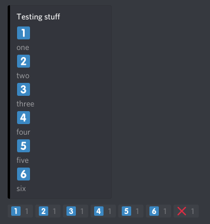
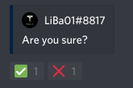

*********
Disputils
*********

Disputils provides some neat features to make your life as a bot developer easier.

Features
########

Quick overview of the available features.

For all features there are two ways to use them.

* just discord.py and a basic ``discord.Client``
* discord.py commands extension (``discord.ext.commands``) and a ``Bot``

In the following we're going to use the second way since it's a bit easier.

.. code-block:: py

    from disputils import BotEmbedPaginator, BotConfirmation, BotMultipleChoice

Pagination
**********

Split your content into multiple pages and use reactions to paginate through.

.. code-block:: py

    @bot.command()
    async def paginate(ctx):
        embeds = [
            Embed(title="test page 1", description="This is just some test content!", color=0x115599),
            Embed(title="test page 2", description="Nothing interesting here.", color=0x5599ff),
            Embed(title="test page 3", description="Why are you still here?", color=0x191638)
        ]

        paginator = BotEmbedPaginator(ctx, embeds)
        await paginator.run()

Multiple Choice
***************

Let the user decide. Provide multiple choice!

.. code-block:: py

    @bot.command()
    async def choice(ctx):
        multiple_choice = BotMultipleChoice(ctx, ['one', 'two', 'three', 'four', 'five', 'six'], "Testing stuff")
        await multiple_choice.run()

        await multiple_choice.quit(multiple_choice.choice)

Confirmation
************

Is the user going to do something irreversible? Let him confirm first!

.. code-block:: py

    @bot.command()
    async def confirm(ctx):
        confirmation = BotConfirmation(ctx, 0x012345)
        await confirmation.confirm("Are you sure?")

        if confirmation.confirmed:
            await confirmation.update("Confirmed", color=0x55ff55)
        else:
            await confirmation.update("Not confirmed", hide_author=True, color=0xff5555)

Requirements
############

* Python 3.6
* `discord.py v1.0.0`_

.. _discord.py v1.0.0: https://github.com/Rapptz/discord.py/tree/rewrite
